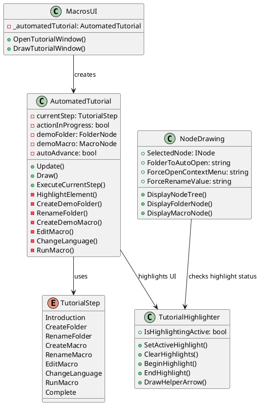

# SomethingNeedDoing Tutorial System

## Overview

The automated tutorial in "Something Need Doing" provides an interactive, step-by-step guide that walks users through creating and using macros. The tutorial system automatically performs each action while highlighting relevant UI elements, creating a guided learning experience.

## Core Components

The tutorial system consists of several key components working together:

1. **AutomatedTutorial class**: The main tutorial window that manages steps, timing, and actions
2. **TutorialHighlighter**: A static utility class that handles UI element highlighting
3. **NodeDrawing**: Manages the UI display with awareness of highlighting
4. **MacrosUI**: The main interface that launches the tutorial

## Tutorial Workflow

The tutorial follows a defined sequence of steps:

| Step | Name | Description |
|------|------|-------------|
| 0 | Introduction | Explains the purpose of the tutorial |
| 1 | CreateFolder | Creates a new folder to organize macros |
| 2 | RenameFolder | Demonstrates renaming the folder |
| 3 | CreateMacro | Creates a new macro inside the folder |
| 4 | RenameMacro | Shows how to rename the macro |
| 5 | EditMacro | Adds content to the macro |
| 6 | ChangeLanguage | Changes the macro language to Lua |
| 7 | RunMacro | Executes the macro |
| 8 | Complete | Summarizes what was learned |

## Implementation Details

### Automation Techniques

The tutorial uses several techniques to automate actions:

#### Direct Object Manipulation
```csharp
// Creates objects directly
demoFolder = new FolderNode { Name = "New Folder" };

// Modifies properties directly
demoMacro.Language = Language.Lua;
```

#### UI Manipulation
```csharp
// Ensure folders are expanded
NodeDrawing.FolderToAutoOpen = demoFolder.Name;

// Simulate right-clicks
NodeDrawing.ForceOpenContextMenu = demoFolder.Name;

// Simulate text input
NodeDrawing.ForceRenameValue = "Tutorial Folder";
```

#### Timing and Sequencing
```csharp
// Schedule actions with delays
ScheduleAction(() => CreateDemoFolder(), 1.0f);

// Handle timing with Update() method
if (waitingForDelay) {
    delayTimer += deltaTime;
    if (delayTimer >= stepDelay) {
        waitingForDelay = false;
        delayTimer = 0f;
        PerformNextAction();
    }
}
```

### Highlighting System

The `TutorialHighlighter` provides visual cues to guide the user:

```csharp
// In AutomatedTutorial class
private void HighlightElement(string elementKey, string tooltip) {
    TutorialHighlighter.IsHighlightingActive = true;
    TutorialHighlighter.SetActiveHighlight(elementKey, tooltip);
}

// In UI element rendering
bool isHighlighted = TutorialHighlighter.BeginHighlight("ElementKey");
// Draw UI element
if (isHighlighted) {
    TutorialHighlighter.EndHighlight("ElementKey");
    TutorialHighlighter.DrawHelperArrow("ElementKey");
}
```

Highlighted elements receive:
- Special colors and border styling
- Helper arrows pointing to them
- Pulsing animations to draw attention
- Tooltips explaining the element

### Tutorial Control Flow

The tutorial manages its state through several key mechanisms:

1. **Step Management**: Tracks current step and provides appropriate UI
2. **Action Scheduling**: Uses delays to sequence actions naturally
3. **Auto-advance**: Optional system to progress through steps automatically
4. **Error Prevention**: Creates prerequisite objects if steps are skipped

## Architecture Diagram



## Key Features

### Tutorial Window

The tutorial window displays:
- Current step description
- Progress bar showing completion status
- Status messages indicating what's happening
- Interactive controls (auto-advance toggle, next/previous buttons)

### Demo Objects

- `demoFolder` and `demoMacro` are created and manipulated throughout the tutorial
- These objects persist for the duration of the tutorial session
- The system ensures they're created in the correct sequence even if steps are skipped

### User Experience

- **Auto-advance**: Enabled by default with a 3-second delay
- **Manual control**: Users can disable auto-advance and navigate with buttons
- **Skip to end**: Option to complete all steps at once
- **Visual feedback**: Highlighted elements draw attention to the current action

## Conclusion

This automated, interactive tutorial system effectively demonstrates key features of the application while minimizing the learning curve for new users. It combines direct object manipulation, UI control techniques, and visual highlighting to create a guided learning experience.
